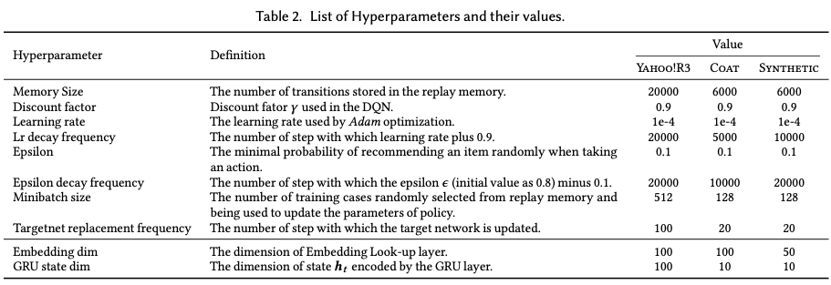

# RL4Rec
A toolkit of Reinforcement Learning based Recommendation (RL4Rec)

## Required packages
You can install conda and then create Python 3.6 Conda environment. Run conda create -n RL4Rec python=3.6 to create the environment. Activate the environment by running conda activate RL4Rec. 
Then try to install the required packages:
```
$ pip install -r requirements.txt
```
Or
```
$ conda install --yes --file requirements.txt
```
## Running the code
```
$ cd examples
$ python run_dqn.py
```

## Parameters
- `./conf/yahoo.properties`
    - `data.input.dataset`: default sim4, a simulated dataset. You can also choose yahoo or coat dataset, which would lead to two kinds of evaluation: (1) Solution-1: Limiting Action Selection; (2) Solution-2: Completing the Rating Matrix.
    - `mode`: default DQN.
    - `seed`: default 2010. Set random seed to achieve reproducibility.
    - `episode_length`: default 10. It means the max number of interaction turns.
    - `evaluation`: default false. It means if we directly evaluate with the saved models.
- `./conf/DQN.properties`
    - `state_encoder`: default GRU. The models of the state encoder include MLP and GRU for now. We will add CNN, Attention etc.
    - Others



## Markov Decision Process (MDP)
We will now describe how we model the recommendation task as an Markov Decision Process (MDP):
- State space : A state represents all the current information on which a decision can be based, including the recommended items and the corresponding feedback, denoted as ), with  the item recommended by the RS in turn k, and  the corresponding user feedback.
- Action space : An action taken by the RS consists of the recommendation of a single item in turn t. 
- Reward : After receiving the action, consisting of item being recommended by the RS, the (simulated) user gives feedback   (i.e. skip or click) on this item.
- Transition probabilities : After the user provides feedback on the recommended item, the state transitions deterministically to the next state by appending this item and feedback to the current state.
- Discount factor : As usual in MDP,   aims to balance the effect of immediate rewards and future rewards. 