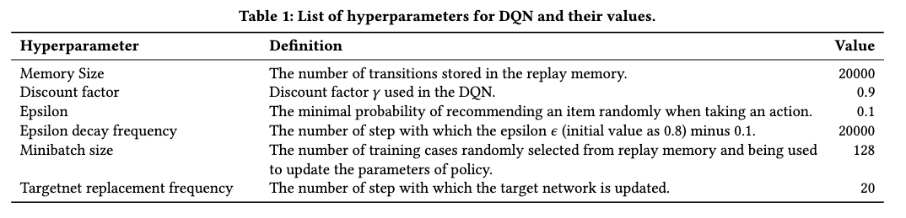

# RL4Rec
This repository contains the code used for the experiments in "State Encoders in Reinforcement Learning for Recommendation: A Reproducibility Study".

## Required packages
You can install conda and then create Python 3.6 Conda environment. Run conda create -n RL4Rec python=3.6 to create the environment. Activate the environment by running conda activate RL4Rec. 
Then try to install the required packages:
```
$ pip install -r requirements.txt
```
Or
```
$ conda install --yes --file requirements.txt
```
## Reproducing Experiments
We compare seven state encoders in a DQN-based RL4Rec framework when evaluating in the debiased simulations of Yahoo! R3 dataset and the coat shopping dataset.

Reproducing the results of policies with the BOI, PLD, Avg, Attention, MLP, GRU, and CNN state encoders in this paper can be done with the following commands with the best hyperparameters given for each state encoder:
#### On the debiased simulation of Yahoo! R3 dataset, 
```
$ cd examples
$ python run_dqn.py --dataset yahoo --state_encoder BOI --action_dim 64 
$ python run_dqn.py --dataset yahoo --state_encoder PLD --action_dim 64 
$ python run_dqn.py --dataset yahoo --state_encoder MLP --action_dim 64 
$ python run_dqn.py --dataset yahoo --state_encoder Att --action_dim 64 --rnn_state_dim 16
$ python run_dqn.py --dataset yahoo --state_encoder MLP --action_dim 64 --activation relu
$ python run_dqn.py --dataset yahoo --state_encoder GRU --action_dim 32 --rnn_state_dim 32
$ python run_dqn.py --dataset yahoo --state_encoder CNN --action_dim 64 --rnn_state_dim 32
```
#### On the debiased simulation of the coat shopping dataset, 
```
$ cd examples
$ python run_dqn.py --dataset coat --state_encoder BOI --action_dim 64 
$ python run_dqn.py --dataset coat --state_encoder PLD --action_dim 64 
$ python run_dqn.py --dataset coat --state_encoder MLP --action_dim 64 
$ python run_dqn.py --dataset coat --state_encoder Att --action_dim 64 --rnn_state_dim 32
$ python run_dqn.py --dataset coat --state_encoder MLP --action_dim 64 --activation tanh
$ python run_dqn.py --dataset coat --state_encoder GRU --action_dim 32 --rnn_state_dim 16
$ python run_dqn.py --dataset coat --state_encoder CNN --action_dim 64 --rnn_state_dim 64
```
The learning curves and evaluation results will be stored in the folder ```./examples/learning_curves/``` and ```./examples/result/```, respectively.
Moreover, results reported in the paper are the averages of 10 independent runs and can be reproduced with random seed 2012 ~ 2021 with seed setting e.g., ```--seed 2012```.

Due to the large size of Yahoo! R3 dataset,  we do not upload it in this project. For using the simulation of Yahoo! R3 dataset, please download [here](https://surfdrive.surf.nl/files/index.php/s/U8bh3zzzaDdlR5u), unzip and put it in the folder ```./data/```.

All the learning curves and results used in the paper are stored; the plots used in the paper can be generated by using the following command:
```
$ python 
```


<!-- ## Parameters
- `./conf/yahoo.properties`
    - `data.input.dataset`: default sim4, a simulated dataset. You can also choose yahoo or coat dataset, which would lead to two kinds of evaluation: (1) Solution-1: Limiting Action Selection; (2) Solution-2: Completing the Rating Matrix.
    - `mode`: default DQN.
    - `seed`: default 2010. Set random seed to achieve reproducibility.
    - `episode_length`: default 10. It means the max number of interaction turns.
    - `evaluation`: default false. It means if we directly evaluate with the saved models.
- `./conf/DQN.properties`
    - `state_encoder`: default GRU. The models of the state encoder include MLP and GRU for now. We will add CNN, Attention etc.
    - Others -->

<!--  -->

<!-- ## Markov Decision Process (MDP)
We will now describe how we model the recommendation task as an Markov Decision Process (MDP):
- State space : A state represents all the current information on which a decision can be based, including the recommended items and the corresponding feedback, denoted as ), with  the item recommended by the RS in turn k, and  the corresponding user feedback.
- Action space : An action taken by the RS consists of the recommendation of a single item in turn t. 
- Reward : After receiving the action, consisting of item being recommended by the RS, the (simulated) user gives feedback   (i.e. skip or click) on this item.
- Transition probabilities : After the user provides feedback on the recommended item, the state transitions deterministically to the next state by appending this item and feedback to the current state.
- Discount factor : As usual in MDP,   aims to balance the effect of immediate rewards and future rewards.  -->